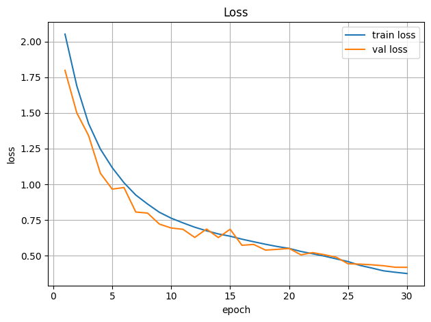
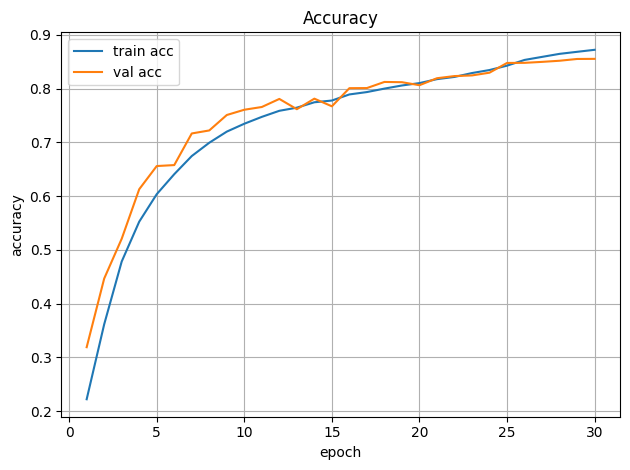
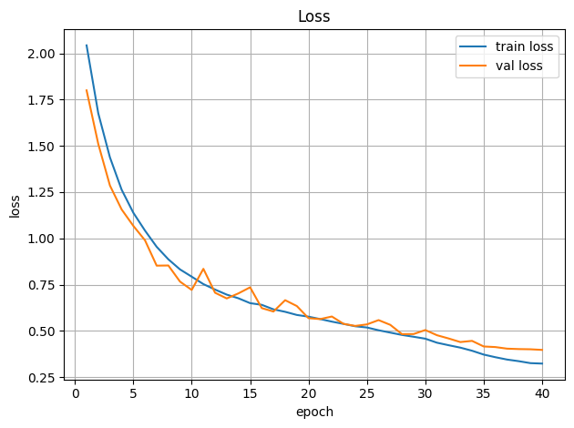
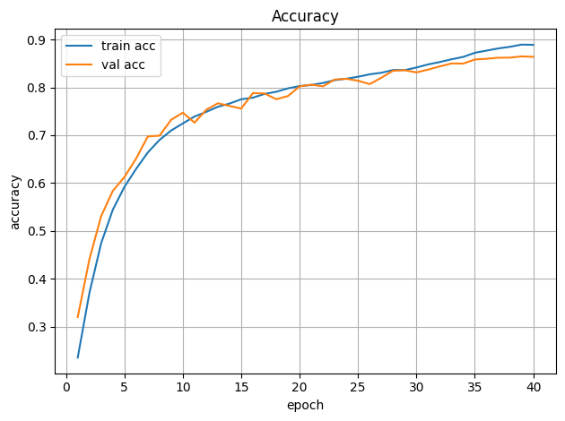

# CIFAR-10 Classification with Custom CNN Architecture

This project implements a custom CNN architecture for CIFAR-10 image classification using PyTorch. The model employs various advanced techniques including depthwise separable convolutions and dilated convolutions to achieve high accuracy while maintaining computational efficiency.

## Overall Target
- **Accuracy**: 85%
- **Epochs**: Not Defined
- **Parameters**: <200k parameters
- **Architecture**: C1C2C3C4O

## Results Summary

| Sr # | Train Acc | Test Acc | Parameters | Epochs | Target Met |
|-------|-----------|----------|------------|---------|------------|
| 1 | 87.20 | 85.22 | 195,946 | 30 | Yes |
| 2 | 88.94 | 86.48 | 195,946 | 40 | Yes |

## Model Architecture

The model architecture consists of four main blocks:

### Block1: Standard Convolutional Block
- Two standard convolutional layers with batch normalization and ReLU activation
- Input: 3 channels (RGB images)
- Output: 32 channels

### Block2: Depthwise Separable Convolution Block
- Initial convolution layer (32 → 64 channels)
- Depthwise convolution (3x3 kernel, groups=64)
- Pointwise convolution (1x1 kernel, stride=2)
- Batch normalization and ReLU activation

### Block3: Depthwise Separable Convolution Block
- Initial convolution layer (64 → 128 channels)
- Depthwise convolution (3x3 kernel, groups=128)
- Pointwise convolution (1x1 kernel, stride=2)
- Batch normalization and ReLU activation

### Block4: Dilated Convolution Block
- 2x2 convolution reducing channels (128 → 64)
- 3x3 dilated convolution with dilation rate of 3
- Batch normalization and ReLU activation

### Final Classification Layers
- Adaptive average pooling to 1x1 spatial dimensions
- Flattening
- Dropout (10% rate)
- Fully connected layer to 10 classes (CIFAR-10 categories)

### Receptive Field Analysis
The model has an estimated receptive field of 45, calculated from the sequence of convolutions:
```
[
    {'k':3, 's':1, 'd':1},    # C1
    {'k':3, 's':1, 'd':1},    # C1
    {'k':3, 's':1, 'd':1},    # C2 
    {'k':3, 's':1, 'd':1},    # C2 
    {'k':1, 's':2, 'd':1},    # C2 
    {'k':3, 's':1, 'd':1},    # C3
    {'k':3, 's':1, 'd':1},    # C3
    {'k':1, 's':2, 'd':1},    # C3
    {'k':2, 's':1, 'd':1},    # C4
    {'k':3, 's':1, 'd':3},    # C4
]
```

## Training Techniques

### Data Augmentation
The model uses Albumentations for data augmentation with the following transformations:
- Horizontal flipping (50% probability)
- Shift, scale, and rotation (70% probability)
- Coarse dropout (cutout) with 16x16 pixel holes (50% probability)
- Normalization using CIFAR-10 mean and standard deviation

### Optimization
- Loss function: Cross-Entropy Loss
- Optimizer: SGD with momentum (0.9) and weight decay (5e-4)
- Learning rate scheduler: OneCycleLR
  - Maximum learning rate: 0.02
  - Percentage of cycle spent increasing LR: 30%
  - Initial learning rate: max_lr/25
  - Minimum learning rate: max_lr/1000
  - Cosine annealing strategy
  - Cycle momentum: True (0.85 to 0.95)

### Training Parameters
- Batch size: 128
- Epochs: 30
- Device: CUDA if available, otherwise CPU

## Model Performance

The model achieves good performance on the CIFAR-10 dataset with the following characteristics:

- Total parameters: Approximately 195,946 parameters
- Receptive field: 45

## Logs

```
==================================================
MODEL SUMMARY
==================================================

----------------------------------------------------------------
        Layer (type)               Output Shape         Param #
================================================================
            Conv2d-1           [-1, 32, 30, 30]             864
       BatchNorm2d-2           [-1, 32, 30, 30]              64
              ReLU-3           [-1, 32, 30, 30]               0
            Conv2d-4           [-1, 32, 28, 28]           9,216
       BatchNorm2d-5           [-1, 32, 28, 28]              64
              ReLU-6           [-1, 32, 28, 28]               0
            Block1-7           [-1, 32, 28, 28]               0
            Conv2d-8           [-1, 64, 26, 26]          18,432
       BatchNorm2d-9           [-1, 64, 26, 26]             128
             ReLU-10           [-1, 64, 26, 26]               0
           Conv2d-11           [-1, 64, 24, 24]             576
           Conv2d-12           [-1, 64, 12, 12]           4,096
      BatchNorm2d-13           [-1, 64, 12, 12]             128
             ReLU-14           [-1, 64, 12, 12]               0
           Block2-15           [-1, 64, 12, 12]               0
           Conv2d-16          [-1, 128, 10, 10]          73,728
      BatchNorm2d-17          [-1, 128, 10, 10]             256
             ReLU-18          [-1, 128, 10, 10]               0
           Conv2d-19            [-1, 128, 8, 8]           1,152
           Conv2d-20            [-1, 128, 4, 4]          16,384
      BatchNorm2d-21            [-1, 128, 4, 4]             256
             ReLU-22            [-1, 128, 4, 4]               0
           Block3-23            [-1, 128, 4, 4]               0
           Conv2d-24             [-1, 64, 9, 9]          32,768
      BatchNorm2d-25             [-1, 64, 9, 9]             128
             ReLU-26             [-1, 64, 9, 9]               0
           Conv2d-27             [-1, 64, 9, 9]          36,928
      BatchNorm2d-28             [-1, 64, 9, 9]             128
             ReLU-29             [-1, 64, 9, 9]               0
           Block4-30             [-1, 64, 9, 9]               0
AdaptiveAvgPool2d-31             [-1, 64, 1, 1]               0
          Flatten-32                   [-1, 64]               0
          Dropout-33                   [-1, 64]               0
           Linear-34                   [-1, 10]             650
================================================================
Total params: 195,946
Trainable params: 195,946
Non-trainable params: 0
----------------------------------------------------------------
Input size (MB): 0.01
Forward/backward pass size (MB): 3.67
Params size (MB): 0.75
Estimated Total Size (MB): 4.43
----------------------------------------------------------------
```

### With 30 epochs 

```
Total parameters: 195,946
Estimated receptive field: 45
/usr/local/lib/python3.11/dist-packages/albumentations/core/validation.py:114: UserWarning: ShiftScaleRotate is a special case of Affine transform. Please use Affine transform instead.
  original_init(self, **validated_kwargs)
/kaggle/working/train.py:55: UserWarning: Argument(s) 'num_holes, max_h_size, max_w_size, min_h_size, min_w_size, fill_value' are not valid for transform CoarseDropout
  A.CoarseDropout(
100%|██████████| 170M/170M [00:02<00:00, 63.2MB/s] 
Epoch 1/30 | LR(s): [0.001379] | Train loss 2.0513 acc 0.2223 | Val loss 1.7977 acc 0.3191
Epoch 2/30 | LR(s): [0.003047] | Train loss 1.6890 acc 0.3617 | Val loss 1.5001 acc 0.4467
Epoch 3/30 | LR(s): [0.005602] | Train loss 1.4249 acc 0.4784 | Val loss 1.3413 acc 0.5207
Epoch 4/30 | LR(s): [0.008737] | Train loss 1.2469 acc 0.5525 | Val loss 1.0777 acc 0.6128
Epoch 5/30 | LR(s): [0.012072] | Train loss 1.1174 acc 0.6036 | Val loss 0.9669 acc 0.6559
Epoch 6/30 | LR(s): [0.015205] | Train loss 1.0114 acc 0.6408 | Val loss 0.9779 acc 0.6577
Epoch 7/30 | LR(s): [0.017758] | Train loss 0.9254 acc 0.6745 | Val loss 0.8066 acc 0.7165
Epoch 8/30 | LR(s): [0.019424] | Train loss 0.8625 acc 0.6993 | Val loss 0.7990 acc 0.7221
Epoch 9/30 | LR(s): [0.020000] | Train loss 0.8047 acc 0.7199 | Val loss 0.7222 acc 0.7508
Epoch 10/30 | LR(s): [0.019888] | Train loss 0.7635 acc 0.7346 | Val loss 0.6948 acc 0.7606
Epoch 11/30 | LR(s): [0.019555] | Train loss 0.7307 acc 0.7473 | Val loss 0.6856 acc 0.7657
Epoch 12/30 | LR(s): [0.019008] | Train loss 0.7002 acc 0.7586 | Val loss 0.6288 acc 0.7807
Epoch 13/30 | LR(s): [0.018260] | Train loss 0.6752 acc 0.7645 | Val loss 0.6874 acc 0.7616
Epoch 14/30 | LR(s): [0.017328] | Train loss 0.6533 acc 0.7745 | Val loss 0.6279 acc 0.7812
Epoch 15/30 | LR(s): [0.016232] | Train loss 0.6374 acc 0.7777 | Val loss 0.6858 acc 0.7670
Epoch 16/30 | LR(s): [0.014997] | Train loss 0.6167 acc 0.7891 | Val loss 0.5738 acc 0.8007
Epoch 17/30 | LR(s): [0.013650] | Train loss 0.5984 acc 0.7935 | Val loss 0.5796 acc 0.8009
Epoch 18/30 | LR(s): [0.012222] | Train loss 0.5809 acc 0.7999 | Val loss 0.5401 acc 0.8123
Epoch 19/30 | LR(s): [0.010744] | Train loss 0.5651 acc 0.8057 | Val loss 0.5454 acc 0.8118
Epoch 20/30 | LR(s): [0.009249] | Train loss 0.5519 acc 0.8101 | Val loss 0.5518 acc 0.8062
Epoch 21/30 | LR(s): [0.007772] | Train loss 0.5307 acc 0.8175 | Val loss 0.5072 acc 0.8192
Epoch 22/30 | LR(s): [0.006344] | Train loss 0.5144 acc 0.8216 | Val loss 0.5224 acc 0.8232
Epoch 23/30 | LR(s): [0.004997] | Train loss 0.4979 acc 0.8288 | Val loss 0.5076 acc 0.8244
Epoch 24/30 | LR(s): [0.003763] | Train loss 0.4786 acc 0.8344 | Val loss 0.4903 acc 0.8295
Epoch 25/30 | LR(s): [0.002668] | Train loss 0.4597 acc 0.8425 | Val loss 0.4445 acc 0.8476
Epoch 26/30 | LR(s): [0.001736] | Train loss 0.4332 acc 0.8532 | Val loss 0.4418 acc 0.8478
Epoch 27/30 | LR(s): [0.000989] | Train loss 0.4148 acc 0.8589 | Val loss 0.4373 acc 0.8496
Epoch 28/30 | LR(s): [0.000444] | Train loss 0.3951 acc 0.8645 | Val loss 0.4306 acc 0.8517
Epoch 29/30 | LR(s): [0.000112] | Train loss 0.3850 acc 0.8683 | Val loss 0.4201 acc 0.8550
Epoch 30/30 | LR(s): [0.000001] | Train loss 0.3761 acc 0.8720 | Val loss 0.4195 acc 0.8552
Best val acc: 0.8552
```




### With 40 epochs

```
Total parameters: 195,946
Estimated receptive field: 45
100%|██████████| 170M/170M [00:18<00:00, 9.10MB/s] 
Epoch 1/40 | LR(s): [0.001127] | Train loss 2.0432 acc 0.2350 | Val loss 1.7999 acc 0.3198
Epoch 2/40 | LR(s): [0.002087] | Train loss 1.6762 acc 0.3703 | Val loss 1.5105 acc 0.4407
Epoch 3/40 | LR(s): [0.003613] | Train loss 1.4378 acc 0.4736 | Val loss 1.2857 acc 0.5304
Epoch 4/40 | LR(s): [0.005602] | Train loss 1.2633 acc 0.5441 | Val loss 1.1565 acc 0.5835
Epoch 5/40 | LR(s): [0.007918] | Train loss 1.1388 acc 0.5921 | Val loss 1.0678 acc 0.6126
Epoch 6/40 | LR(s): [0.010403] | Train loss 1.0422 acc 0.6297 | Val loss 0.9898 acc 0.6512
Epoch 7/40 | LR(s): [0.012888] | Train loss 0.9545 acc 0.6639 | Val loss 0.8526 acc 0.6975
Epoch 8/40 | LR(s): [0.015204] | Train loss 0.8869 acc 0.6901 | Val loss 0.8535 acc 0.6990
Epoch 9/40 | LR(s): [0.017192] | Train loss 0.8322 acc 0.7099 | Val loss 0.7663 acc 0.7323
Epoch 10/40 | LR(s): [0.018717] | Train loss 0.7930 acc 0.7247 | Val loss 0.7213 acc 0.7472
Epoch 11/40 | LR(s): [0.019674] | Train loss 0.7529 acc 0.7391 | Val loss 0.8355 acc 0.7263
Epoch 12/40 | LR(s): [0.020000] | Train loss 0.7233 acc 0.7487 | Val loss 0.7062 acc 0.7531
Epoch 13/40 | LR(s): [0.019937] | Train loss 0.6960 acc 0.7595 | Val loss 0.6753 acc 0.7668
Epoch 14/40 | LR(s): [0.019749] | Train loss 0.6762 acc 0.7662 | Val loss 0.7027 acc 0.7612
Epoch 15/40 | LR(s): [0.019438] | Train loss 0.6500 acc 0.7752 | Val loss 0.7354 acc 0.7557
Epoch 16/40 | LR(s): [0.019008] | Train loss 0.6408 acc 0.7785 | Val loss 0.6231 acc 0.7881
Epoch 17/40 | LR(s): [0.018466] | Train loss 0.6164 acc 0.7864 | Val loss 0.6047 acc 0.7872
Epoch 18/40 | LR(s): [0.017817] | Train loss 0.6032 acc 0.7908 | Val loss 0.6660 acc 0.7752
Epoch 19/40 | LR(s): [0.017069] | Train loss 0.5862 acc 0.7980 | Val loss 0.6343 acc 0.7819
Epoch 20/40 | LR(s): [0.016233] | Train loss 0.5769 acc 0.8028 | Val loss 0.5688 acc 0.8021
Epoch 21/40 | LR(s): [0.015318] | Train loss 0.5640 acc 0.8050 | Val loss 0.5638 acc 0.8057
Epoch 22/40 | LR(s): [0.014336] | Train loss 0.5501 acc 0.8092 | Val loss 0.5778 acc 0.8022
Epoch 23/40 | LR(s): [0.013300] | Train loss 0.5378 acc 0.8151 | Val loss 0.5381 acc 0.8164
Epoch 24/40 | LR(s): [0.012223] | Train loss 0.5250 acc 0.8181 | Val loss 0.5269 acc 0.8180
Epoch 25/40 | LR(s): [0.011117] | Train loss 0.5184 acc 0.8222 | Val loss 0.5350 acc 0.8139
Epoch 26/40 | LR(s): [0.009998] | Train loss 0.5034 acc 0.8273 | Val loss 0.5583 acc 0.8069
Epoch 27/40 | LR(s): [0.008878] | Train loss 0.4907 acc 0.8306 | Val loss 0.5328 acc 0.8203
Epoch 28/40 | LR(s): [0.007772] | Train loss 0.4782 acc 0.8363 | Val loss 0.4826 acc 0.8348
Epoch 29/40 | LR(s): [0.006695] | Train loss 0.4683 acc 0.8362 | Val loss 0.4831 acc 0.8359
Epoch 30/40 | LR(s): [0.005659] | Train loss 0.4579 acc 0.8416 | Val loss 0.5046 acc 0.8313
Epoch 31/40 | LR(s): [0.004678] | Train loss 0.4361 acc 0.8480 | Val loss 0.4766 acc 0.8372
Epoch 32/40 | LR(s): [0.003764] | Train loss 0.4225 acc 0.8530 | Val loss 0.4590 acc 0.8439
Epoch 33/40 | LR(s): [0.002928] | Train loss 0.4095 acc 0.8587 | Val loss 0.4396 acc 0.8500
Epoch 34/40 | LR(s): [0.002181] | Train loss 0.3928 acc 0.8637 | Val loss 0.4460 acc 0.8497
Epoch 35/40 | LR(s): [0.001532] | Train loss 0.3720 acc 0.8723 | Val loss 0.4158 acc 0.8583
Epoch 36/40 | LR(s): [0.000990] | Train loss 0.3577 acc 0.8769 | Val loss 0.4126 acc 0.8598
Epoch 37/40 | LR(s): [0.000561] | Train loss 0.3451 acc 0.8814 | Val loss 0.4040 acc 0.8620
Epoch 38/40 | LR(s): [0.000251] | Train loss 0.3363 acc 0.8848 | Val loss 0.4017 acc 0.8622
Epoch 39/40 | LR(s): [0.000063] | Train loss 0.3258 acc 0.8894 | Val loss 0.4006 acc 0.8648
Epoch 40/40 | LR(s): [0.000001] | Train loss 0.3234 acc 0.8890 | Val loss 0.3973 acc 0.8639
Best val acc: 0.8648
```

